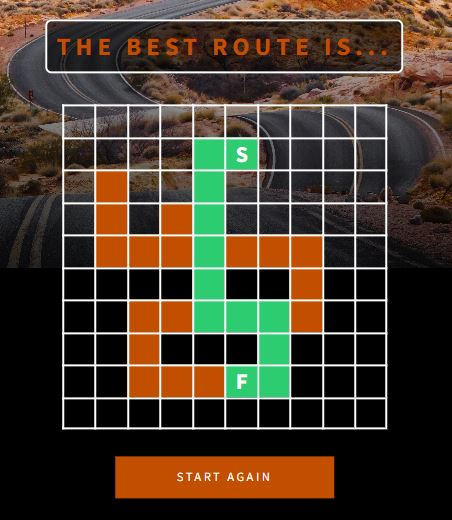

# Pathfinder

The website app allows us to find shortest way between two indicated points, going only through the paths marked earlier by the user. It is a single-page application (SPA). 

## [Demo](https://pathfinder.bpedryc83.repl.co/#/finder)

## Technologies

- HTML
- CSS/SCSS
- Vanilla JS

This website app has been developed following Responsive Web Design (RWD).
  &nbsp;
The design is based on a provided template and pictures, with some individual changes made later. The entire code has been developed just by the author (Bartłomiej Pedryc).

## Overview

* About 
  * Welcome page with an implemented external AOS script.
  &nbsp;
* Finder
  * |Draw Routes| At this stage, the user selects the possible paths that interest them. Subsequent cell selections are only possible within slightly highlighted areas, following the application's hints. It is also possible to deselect a cell if it does not break the continuity of the already drawn path.
  * |Mark start and finish| 
Next, the user specifies the start and finish points on the drawn paths to find the shortest possible connection in the following step. If the start or finish point is incorrectly marked, you can click again after marking the end cell to restart the marking procedure.
  * |Find the best route| Click the "Search Path" button to find the shortest connection running along the marked paths between the designated start and finish cells.
  * |Statistics| Statistics will be displayed, including the quantity and length of possible routes.
  * |Look at the shortest route| After closing the statistics, you will be able to fully view the drawn shortest route..  
  &nbsp;

## Screenshots

### Draw routes
{:width="350px" height="399px"} 
  &nbsp;
### Mark start and finish  
{:width="340px" height="407px"}  
  &nbsp;
### Find the best route
{:width="325px" height="375px"}
  &nbsp;
### Receive the possible routes statistics  
  
  &nbsp;